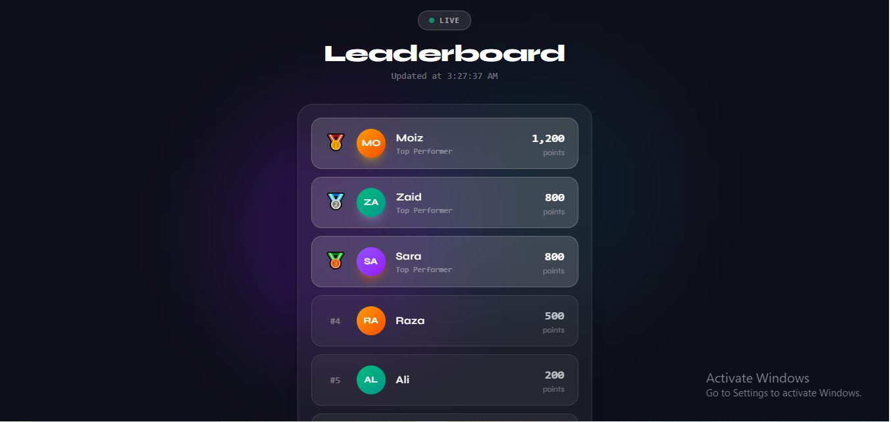

# 🏆 Live Leaderboard System

A real-time leaderboard system built with Node.js, Redis, and React. Users can earn points, track rankings, and see live updates without refreshing the page.

---

## 📸 Preview



---

## 🏗️ Project Structure

```
live-leaderboard/
├── backend/          # Node.js + Express + Redis
│   ├── server.js
│   ├── docker-compose.yml
│   └── package.json
└── frontend/         # React + Tailwind CSS
    ├── src/
    │   └── App.jsx
    └── package.json
```

---

## ⚡ Tech Stack

| Layer | Technology |
|-------|-----------|
| Backend | Node.js, Express |
| Database | Redis (Sorted Sets) |
| Frontend | React, Tailwind CSS |
| DevOps | Docker |

---

## 🔴 Redis Commands Used

| Command | Purpose |
|---------|---------|
| `INCR` | Atomic view counter - no race condition |
| `ZINCRBY` | Add points to user score |
| `ZREVRANGE` | Fetch top 10 leaders |
| `ZREVRANK` | Get specific user rank |
| `ZSCORE` | Get user total score |

---

## 🚀 Getting Started

### Prerequisites
- Node.js installed
- Docker installed

### 1️⃣ Clone the repo
```bash
git clone https://github.com/moizmalik13588/live-leaderboard.git
cd live-leaderboard
```

### 2️⃣ Start Redis
```bash
cd backend
docker-compose up -d
```

### 3️⃣ Start Backend
```bash
cd backend
npm install
npm run dev
```

### 4️⃣ Start Frontend
```bash
cd frontend
npm install
npm run dev
```

### 5️⃣ Open Browser
```
http://localhost:5173
```

---

## 📡 API Endpoints

### Post Views
```
POST /post/:id/view
```
Increments view count of a post atomically.

---

### Add Points to User
```
POST /leaderboard/score

Body:
{
  "userId": "ahmed",
  "points": 50
}
```

---

### Get Top 10 Leaders
```
GET /leaderboard
```
```json
{
  "leaderboard": [
    { "rank": 1, "userId": "sara",  "score": "800" },
    { "rank": 2, "userId": "raza",  "score": "500" }
  ]
}
```

---

### Get User Rank
```
GET /leaderboard/:userid/rank
```
```json
{
  "userId": "sara",
  "rank": 1,
  "score": "800"
}
```

---

## 💡 Why Redis over SQL?

| | SQL | Redis |
|--|-----|-------|
| Speed | Disk based 🐢 | RAM based ⚡ |
| Sorting | Heavy query | Built-in Sorted Sets |
| Concurrent writes | Race condition risk | INCR is atomic |
| Real-time ranking | Slow at scale | Instant |

---

## 🍵 Inspired By

Assignment from **Chai aur Code** by [Hitesh Choudhary](https://www.youtube.com/@HiteshChoudharydotcom)

---

## 👨‍💻 Author

**Moiz Malik**
- GitHub: [@moizmalik13588](https://github.com/moizmalik13588)
- LinkedIn: [Your LinkedIn URL]
